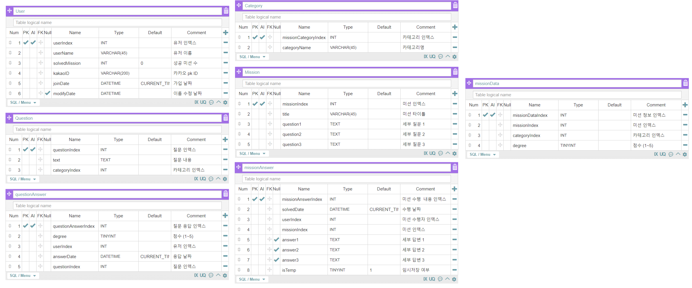

# 2021 Co-Deep Learning Project - Co Green

### ⚙ Environment
    - Ubuntu 18.04
    - Nginx 1.14.0
    - Node 18.15.3
    - Express 4.17.1 
    - MySQL 5.6.4
    - AWS EC2, RDS, Route53

### 📅 Period
    2021/04/10 ~ 2021/06/25

### 🗂 DB

### 📎 API
| Index | Method | URI | Description |
|:-:|:-:|:-|:-|
|1|POST|/user|소셜 로그인|
|2|GET|/user|유저 정보 페이지|
|3|POST|/questions|질문 제출|
|4|GET|/missions/:id|수행 미션 제공|
|5|PATCH|/missions/:id?emporary=TRUE/|미션 제출|
